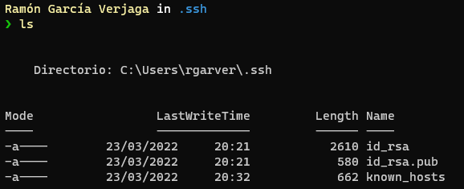
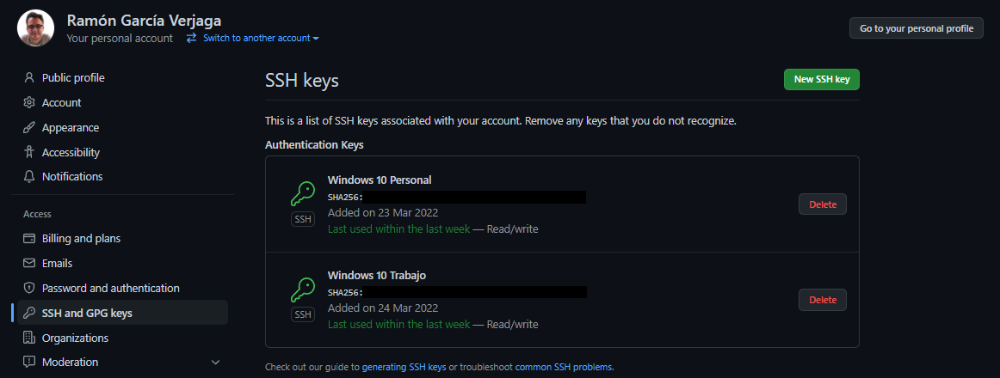
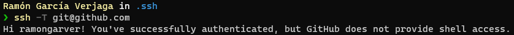
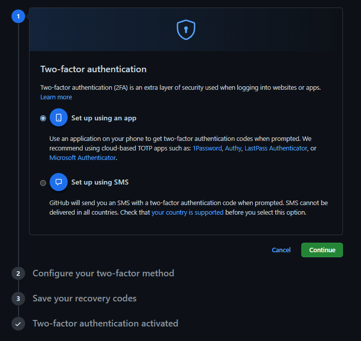
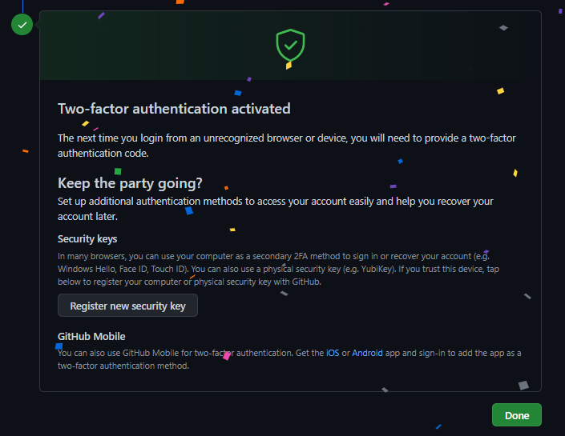
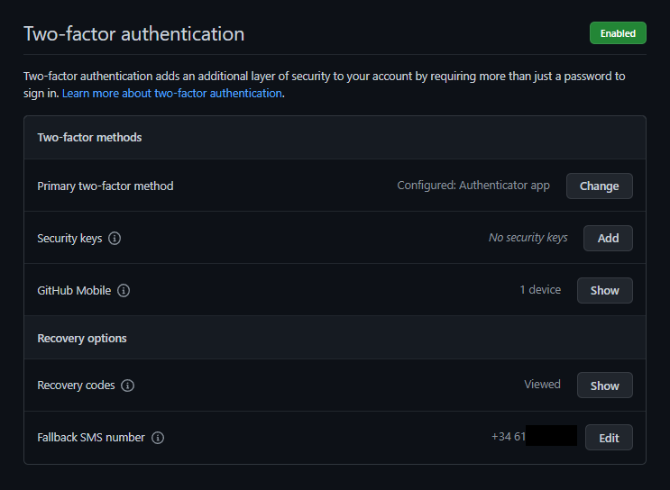

# [Hito 0]( http://jj.github.io/CC/documentos/proyecto/0.Repositorio): Descripción del problema a resolver usando correctamente git y GitHub

## Creación de par de claves y subida de clave pública a GitHub
Para la generación del par de clave pública y clave privada y la posterior adición de la clave pública a GitHub se ha utilizado la siguiente [guía](https://docs.github.com/en/authentication/connecting-to-github-with-ssh/generating-a-new-ssh-key-and-adding-it-to-the-ssh-agent).

Ejecutamos la siguiente orden para generar el par de claves pública/privada:  
`$ ssh-keygen -t ed25519 -C "ramongarver2000@gmail.com"`

Comprobamos en el directorio *.ssh* que las claves se han generado:

Como podemos observar, se han generado correctamente ambos ficheros:
- ***id_rsa***: donde se almacena la clave privada (que no se la tenemos que proveer a nadie).
- ***id_rsa.pub***: donde se almacena la clave pública (que se la tenemos que proveer a la organización en la que nos queramos identificar, en nuestro caso tenemos que subirla a GitHub).

Tras haber añadido la clave pública a GitHub la configuración quedaría de la siguiente forma:  
💡 *Cabe destacar que yo ya tenía configuradas las claves con anterioridad. Esa es la causa por la que la fecha de adición de las mismas es previa a la fecha de realización de la práctica.*

Podemos comprobar que, efectivamnete, nos podemos autenticar correctamente desde la terminal utilizando la siguiente orden:  
`ssh -T git@github.com`

## Configuración correcta del nombre y correo electrónico para que aparezca en los *commits*

Establecemos el nombre del usuario que realiza los commits con ámbito global:  
`git config --global user.name "Ramón García Verjaga"`

Establecemos el correo electrónico del usuario que realiza los commits con ámbito global:  
`git config --global user.email "ramongarver2000@gmail.com"`

Establecemos la estrategia de mergeo de pull requests a rebase con ámbito global:  
`git config --global pull.rebase "true"`

Consultamos las variables de configuración con ámbito global establecidas:  
`git config --global --list`

## Edición del perfil de GitHub para que aparezca una imagen en vez del avatar por omisión, nombre completo y ciudad, así como universidad

En la siguiente imagen se puede observar como ha quedado el perfil tras la edición del mismo:

## Incrementar la seguridad de nuestra cuenta en GitHub activando el segundo factor de autenticación

Debemos entrar en el apartado de «Contraseñas y autenticación» de la configuración de la cuenta (*Settings > Password and authentication*) y, una vez ahí, habilitar el segundo factor de autenticación realizando los siguientes pasos:

Una vez realizados todos los pasos se habrá activado de forma exitosa el doble factor de autenticación.

Además de haber configurado el método principal de autenticación con la aplicación de generación de códigos OTPs *Google Authenticator*, se han configurado métodos alternativos de autenticación como *Github Mobile*, *Recovery Codes* y *SMS móvil*.

