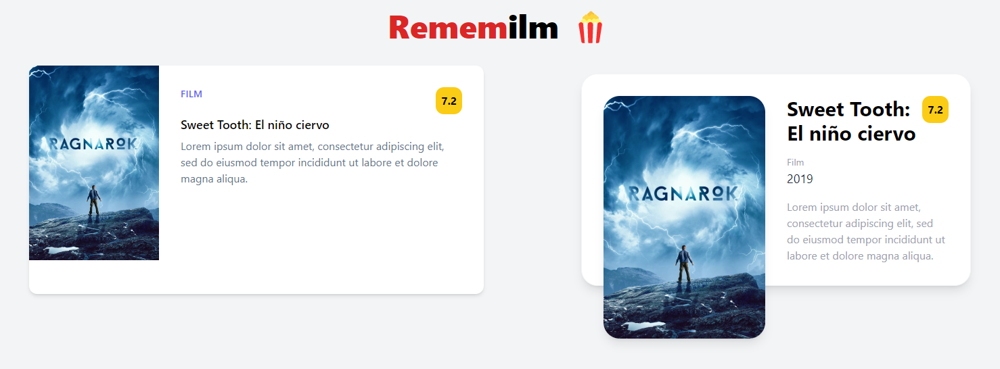

# [Hito 1](http://jj.github.io/CC/documentos/proyecto/1.Infraestructura): Concretando y planificando el proyecto

Esta hito engloba todas las tareas necesarias para definir un proyecto y organizar los hitos para el trabajo en el mismo, así como para avanzar en lo posible en el interfaz y estructuras de datos de la clases iniciales que se vayan a implementar.

## Historias de usuario

📌 [HU-1](https://github.com/ramongarver/MUII-CCFI/issues/14): Como __usuario__, dado que a día de hoy hay un __gran número__ de opciones de __contenido__ en streaming, quiero consultar el contenido que hay disponible, es decir, quiero __ver el catálogo de películas y series__, para __poder decidirme__ por una o por otra.   
📌 [HU-2](https://github.com/ramongarver/MUII-CCFI/issues/15): Como __usuario__, dado que muchas veces __no recuerdo los títulos__ de las películas y series que me han recomendado y si las he visto o no, quiero poder __añadir/quitar contenido__ a/de una __lista__ de contenido __para ver__, con el objetivo de __decidir__ rápidamente __qué contenido ver__.  
📌 [HU-3](https://github.com/ramongarver/MUII-CCFI/issues/16): Como __usuario__, dado que suelo ver varias series o películas simultáneamente, por ejemplo, durante la misma semana, quiero poder __añadir/quitar contenido__ a/de una __lista__ de contenido __en progreso__, con el objetivo de llevar el __seguimiento__ de los __contenidos que estoy viendo__.  
📌 [HU-4](https://github.com/ramongarver/MUII-CCFI/issues/17): Como __usuario__, dado que veo mucho contenido y quiero __saber__ en un __futuro cuál he visto__, quiero poder __añadir/quitar__ contenido a/de una __lista de contenido ya visto__, para poder recordar el contenido ya visto y __no repetir ninguna visualización__ sin querer.  
📌 [HU-5](https://github.com/ramongarver/MUII-CCFI/issues/18): Como __usuario__, dado que __no todo__ el contenido que veo __me gusta__, quiero poder __darle me gusta__ o no __me gusta__ al __contenido__ que marque como __visto__, con el objetivo de poder __recomendar buen contenido__ a gente cercana.  
📌 [HU-6](https://github.com/ramongarver/MUII-CCFI/issues/19): Como __usuario__, dado que __tengo varios dispositivos__ que utilizo en diferentes situaciones, quiero __autenticarme__ en la aplicación para ver mis __listas sincronizadas en cualquier dispositivo__, con el objetivo __no depender__ de un solo dispositivo.  
📌 [HU-7](https://github.com/ramongarver/MUII-CCFI/issues/20): Como __sistema__, dado que todos los días se estrena __nuevo contenido__, quiero tener el __catálogo__ lo más __actualizado__ posible, para ofrecerle a los usuarios la __mejor experiencia__.  

### Usuarios

En la aplicación solo existirá un tipo de usuario ya que no proceden ni roles ni usuarios con permisos especiales de tipo administrador, gestor, etc.

🧑🏽 __Aficionado__ a películas, series y otro contenido en streaming. Está interesado en __consultar el catálogo__ de contenido y en utilizar las __listas para llevar un seguimiento__ de visualización del mismo.

## Milestones

🚩 [Hito-0](https://github.com/ramongarver/MUII-CCFI/milestone/1): __Descripción del proyecto, creación y configuración del repositorio__  
&emsp;&emsp; 🪧 A través de este MVP el programador tendrá un entorno de trabajo preparado en el que podrá desarrollar un proyecto bajo licencia.  
&emsp;&emsp; 🎯 El objetivo principal es realizar todas las configuraciones necesarias a nivel de repositorio así como realizar una descripción del proyecto junto a su lógica de negocio.

🚩 [Hito-1](https://github.com/ramongarver/MUII-CCFI/milestone/2): __Definición, organización y configuración inicial del proyecto__  
&emsp;&emsp; 🪧 A través de este MVP el programador podrá comenzar a desarrollar el proyecto en base a la definición del mismo y su organización.  
&emsp;&emsp; 🎯 El objetivo principal es definir un proyecto y organizar los hitos para el trabajo en el mismo, así como para avanzar en lo posible en el interfaz y estructuras de datos de la clases iniciales que se vayan a implementar.  

🚩 [Hito-2](https://github.com/ramongarver/MUII-CCFI/milestone/3): __Catálogo de contenidos__  
&emsp;&emsp; 🪧 A través de este MVP el usuario podrá buscar y consultar los contenidos que existen.  
&emsp;&emsp; 🎯 El objetivo principal es mostrar al usuario la información primordial de las películas y series (portada, nombre, género, descripción, director y fecha de estreno).  

🚩 [Hito-3](https://github.com/ramongarver/MUII-CCFI/milestone/4): __Lista de contenido para ver__  
&emsp;&emsp; 🪧 A través de este MVP el usuario podrá añadir y quitar contenido a y de su lista de contenido para ver.  
&emsp;&emsp; 🎯 El objetivo principal es permitir que el usuario realice un seguimiento del contenido que quiera ver a través de una lista personal.  

🚩 [Hito-4](https://github.com/ramongarver/MUII-CCFI/milestone/5): __Listas de contenido en progreso y ya visto__  
&emsp;&emsp; 🪧 A través de este MVP el usuario podrá añadir y quitar contenido a y de su listas de contenido en progreso y ya visto.  
&emsp;&emsp; 🎯 El objetivo principal es permitir que el usuario añada contenido a la lista de en progreso y, una vez los quite de la lista, pasen a la lista de ya vistos (a no ser que el usuario indique lo contrario).  

🚩 [Hito-5](https://github.com/ramongarver/MUII-CCFI/milestone/6): __Sistema de likes y dislikes__  
&emsp;&emsp; 🪧 A través de este MVP el usuario podrá decir qué contenido del visto le ha gustado o no.  
&emsp;&emsp; 🎯 El objetivo principal es permitir que el usuario seleccione si un contenido le ha gustado o no cuando pase una película o serie a la lista de «ya visto». De esta forma, podrá ver de un vistazo el contenido que ha visto y que le ha gustado para, por ejemplo, recomendárselo a un amigo.  

🚩 [Hito-6](https://github.com/ramongarver/MUII-CCFI/milestone/7): __Sincronización entre dispositivos__  
&emsp;&emsp; 🪧 A través de este MVP el usuario podrá autenticarse y ver sus listas sincronizadas en diferentes dispositivos.  
&emsp;&emsp; 🎯 El objetivo principal es permitir que el usuario no sea dependiente de un dispositivo en concreto. Es decir, que un usuario pueda actualizar sus listas desde un móvil, desde un portátil o, en definitiva, desde cualquier dispositivo, a través del cual tenga acceso a la aplicación y se pueda autenticar, y esas actualizaciones aparezcan en otros.  

## Creación de estructuras de datos, clases y componentes

Con respecto a la parte relacionada el avance en la creación de las escructuras de datos y clases que se van a implementar a lo largo del proyecto, se ha realizado la implementación de varios componentes
- Encabezado (`Header.jsx`). Sirve para mostrar información sobre la aplicación, en este caso el título. 
- Componentes para mostrar el contenido. Sirven para mostrar las películas y series de diferentes formas y con diferente información. Ahora mismo, poseen los siguientes atributos: _portada, título, tipo (Película | Serie), género, descripción, director, año de estreno y puntuación._
    - `Card.jsx` es el componente situado a la izquierda en la previsualización.
    - `Content.jsx` es el componente situado a la derecha en la previsualización.

### Previsualización de la interfaz de usuario con los componentes creados

