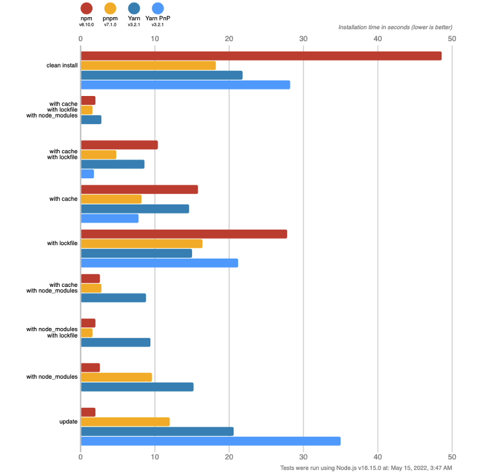
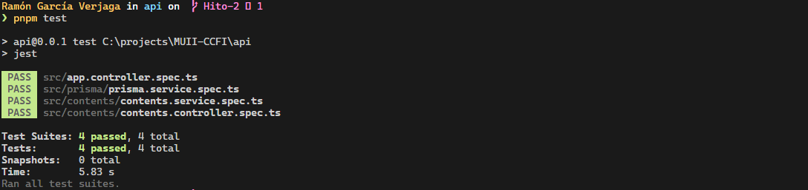
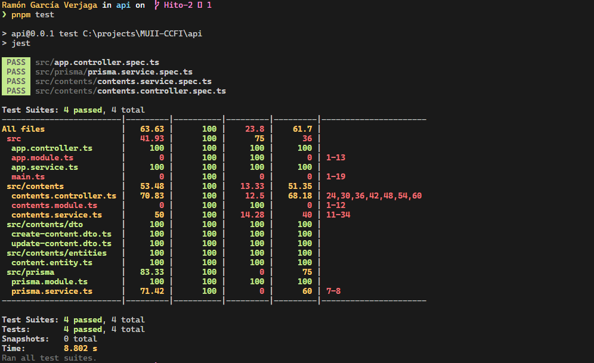
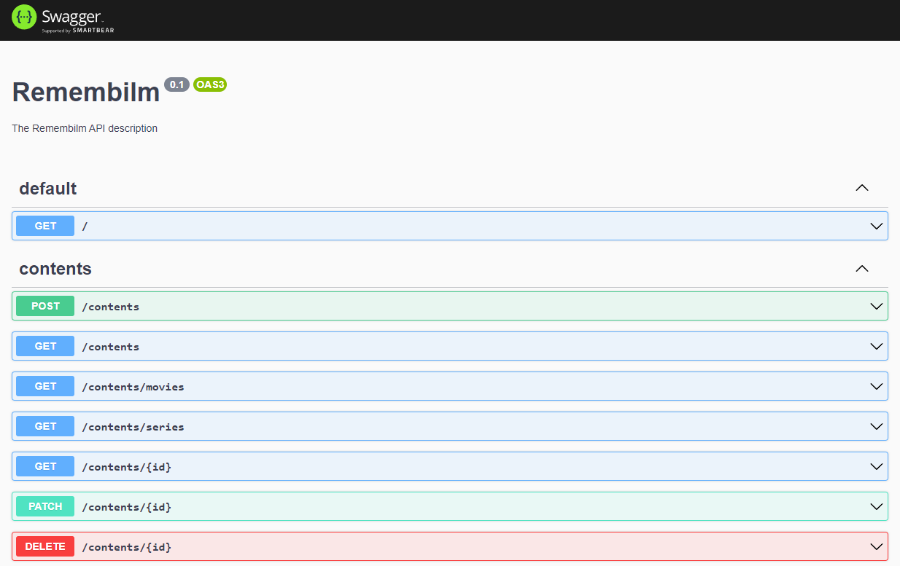
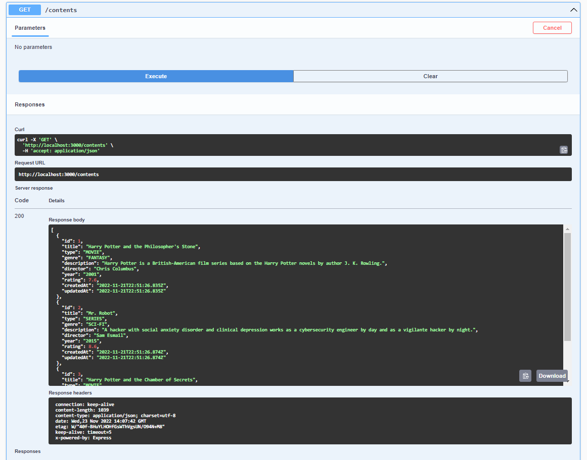

# [Hito 2](http://jj.github.io/CC/documentos/proyecto/2.Tests.html): Tests

Este hito engloba todas las tareas necesarias para establecer y configurar un marco de trabajo para pruebas que permita implementar y ejecutar tests unitarios, así como para añadir una descripción inicial de la infraestructura virtual a la aplicación y a los gestores de dependencias y/o tareas que se utilicen en la misma, la necesaria para que se ejecuten los tests.

## Gestores de paquetes y dependencias

Los gestores de paquetes que se ha valorado utilizar son:

- __npm__: un gestor de paquetes y dependencias para la plataforma _Node.js_. Ubica los módulos en su lugar (en el directorio `node_modules`) para que _Node.js_ pueda encontrarlos, y gestiona los conflictos de dependencias siguiendo una estrategia denominada hoisting. Es ampliamente configurable para soportar una amplia variedad de casos de uso. Lo más habitual es que se utilice para publicar, descubrir, instalar y desarrollar programas de _Node.js_.
- __yarn__: Yarn es un gestor de paquetes para _Node.js_ que se centra en la velocidad, la seguridad y la consistencia. Fue creado originalmente para resolver algunos problemas con el popular gestor de paquetes _npm_.
- __pnpm__: Es una versión mejorada de _npm_, _pnpm_ proviene de **p**erformant-**npm**. Cambia la estrategia de resolución de dependencias de hoisting a content-addressable storage.

Se ha elegido el gestor de paquetes y dependencias _pnpm_. Se parece a _npm_ superficialmente porque su uso del CLI es similar, pero la gestión de las dependencias es muy diferente; el algoritmo de _pnpm_ da lugar a un mejor rendimiento, al ahorro de memoria y a la mejor gestión del espacio en disco. El gestor de y dependencias paquetes _yarn_ sigue siendo muy popular, pero se considera legacy y es posible que se deje de dar soporte en un futuro próximo. _Yarn Berry PnP_ es su evolución, pero aún no ha desarrollado lo suficiente como para explotar todo su potencial.

El principal problema que tenían los creadores de _pnpm_ con _npm_ y _yarn_ era el almacenamiento redundante de dependencias que se utilizaban en todos los proyectos. Aunque _yarn classic_ tenía ventajas de velocidad sobre _npm_, utilizaba el mismo enfoque de resolución de dependencias, es decir, utilizaban hoisting como estrategia de resolución de dependecias.

En lugar del hoisting, _pnpm_ introdujo una estrategia alternativa de resolución de dependencias: content-addressable storage (almacenamiento direccionable por contenido). Este método da lugar a una carpeta node_modules anidada que almacena los paquetes en un almacén global en su carpeta de inicio (`~/.pnpm-store/`). Cada versión de una dependencia se almacena físicamente en esa carpeta sólo una vez, siendo la única fuente y ahorrando bastante espacio en disco.

El gestor de paquetes y dependencias _pnpm_ utiliza un sistema de archivos de contenido direccionable para almacenar los paquetes y las dependencias en el disco. Esto significa que el mismo paquete no se duplicará. Incluso con diferentes versiones del mismo paquete, _pnpm_ es lo suficientemente inteligente como para reutilizar el máximo de código. Si una versión del paquete 1 tiene 500 archivos y la versión 2 tiene sólo un archivo más, entonces pnpm no escribirá 501 archivos para la versión 2; en su lugar, creará un enlace duro a los 500 archivos originales y escribirá sólo el nuevo archivo. Si se realizara con _npm_, la versión 2 también se cargaría duplicando los 500 archivos originales. Para grandes proyectos monorepo, puede hacer que exista una gran diferencia. Por ejemplo, si existe un caso donde un paquete es necesario por cientos de otros paquetes, este paquete existirá en disco tantas veces como sea utilizado por otros paquetes, lo que podría generar problemas asociados al espacio en el disco, lo cual se podría solucionar con la utilización de _pnpm_.



Como se muestra en los resultados de las pruebas de referencia anteriores, _pnpm_ se ha comportado en general mucho mejor que _npm_ y _yarn_. No es de extrañar que empresas tecnológicas gigantes como Vue3, Prism y Microsoft estén adoptando rápidamente _pnpm_.

Instalación de _pnpm_:

```bash
npm i -g pnpm
```

El estado inicial de un proyecto _pnpm_ es igual que el de un proyecto _npm_ o _yarn_: se necesita un archivo `package.json`. Después de instalar las dependencias con `pnpm i`, se genera una carpeta `node_modules`, pero su estructura es completamente diferente debido a su enfoque de almacenamiento de contenido direccionable.

El gestor de paquetes y dependencias _pnpm_ también genera su propia versión de lockfile, `pnp-lock.yml`. Además, se puede proporcionar una configuración adicional con un archivo opcional `.npmrc`.

## Elección de la metodología de desarrollo de software. TDD vs. BDD

__TDD__ o __Test-Driven Development__ (desarrollo dirigido por pruebas) es una práctica de desarrollo de software que se centra en la creación de pruebas unitarias antes de desarrollar el código real. Es un enfoque iterativo que combina la programación, la creación de pruebas unitarias y la refactorización. Consiste en escribir primero las pruebas (generalmente unitarias), después escribir el código fuente que pase la prueba satisfactoriamente y, por último, refactorizar el código escrito. El proceso sería algo así como: se construye la prueba, se pasa la prueba y falla, se realiza la implementación, se pasa la prueba y tiene éxito.

- Centrado en la implementación de la funcionalidad.
- Prueba comprensibles, casi exclusivamente, por desarrolladores y personal técnico, al estar totalmente ligadas a la implementación.
- No hay necesidad de involucrar a los interesados.
- Es el desarrollador quien escribe las pruebas.
- Cantidad de código imprescindible al realizarse los desarrollos, exclusivamente, para pasar las pruebas existentes.
- Código más robusto y mantenible al centrarse las pruebas en la funcionalidad.

__BDD__ o __Behavior-Driven Development__ (desarrollo dirigido por comportamiento) es una metodología de desarrollo de software en la que una aplicación se documenta y se diseña en torno al comportamiento que un usuario espera experimentar al interactuar con ella. En esta metodología se ayuda a los desarrolladores a centrarse únicamente en los comportamientos requeridos en una aplicación. Ayuda a evitar la sobrecarga, el exceso de código, las características innecesarias o la falta de enfoque.

- Centrado en el comportamiento del usuario al interactuar con la aplicación.
- Pruebas compresibles por cualquier persona, incluidas aquellas sin conocimientos técnicos.
- Necesidad de involucrar a los interesados.
- Es el usuario final, junto al resto del equipo multidisciplinar, quien escribe las pruebas.
- Errores difíciles de rastrear ya que no están asociados a la implementación en sí, sino a la funcionalidad.

En conclusión, elegimos TDD como metodología de desarrollo ya que nos va a permitir reducir fallos y errores en etapas tempranas del desarrollo. Gracias a lo anterior, vamos a pasar menos tiempo arreglando bugs. Además, TDD produce una mayor cobertura de pruebas en general a nivel de implementación de funcionalidades y, por tanto, una mejor calidad del producto final. Por último, y no por ello menos importante, nos va a permitir realizar un desarrollo más rápido al no depender de terceras partes, lo que es de especial interés para entregar lo antes posible los MVPs.

## Marco de trabajo para pruebas y biblioteca de aserciones

Las pruebas de software son una parte esencial del proceso de desarrollo de cualquier software. Deben realizarse antes de que el software llegue a manos de los usuarios finales. Garantizan que se entreguen productos de software de alta calidad y sin defectos.

Un marco de trabajo para pruebas es una colección de directrices, buenas prácticas y herramientas que resultan útiles a la hora de diseñar, crear y ejecutar casos de prueba. Se basa en la automatización de secuencias de órdenes que emulan casos de prueba para validar implementaciones. Aporta beneficios muy importantes para los usuarios, entre ellos: 

- el alto grado de reutilización de código y de portabilidad, 
- y la reducción en la cantidad de esfuerzo y costo asociados con el mantenimiento de los scripts.

### Elección y uso del marco de trabajo para pruebas y de la biblioteca de aserciones

La búsqueda sobre marcos de trabajo para pruebas en proyectos basados en `Node.js` ha dado lugar a la valoración de __Mocha__ y __Jest__, los dos marcos de trabajo para pruebas más usados en los últimos años.


[__Mocha__](https://mochajs.org/) es un marco de trabajo para pruebas que lleva algunos años en el mercado, concretamente desde noviembre de 2011, cuando fue lanzado. Durante algunos años ha ocupado gran parte de la cuota de mercado. Depende bibliotecas de aserciones de terceros, mocking y herramientas de espionaje como [_Sinon_](https://sinonjs.org/) y [_Chai_](https://www.chaijs.com/). Es muy extensible y tiene una gran cantidad de plugins, extensiones y bibliotecas diseñadas para ejecutarse sobre él.

[__Jest__](https://jestjs.io/es-ES/) es el marco de trabajo para pruebas de _JavaScript_ más utilizado en la actualidad. Su popularidad ha crecido de forma constante desde 2016. En la edición más reciente de [«State of JS»](https://2021.stateofjs.com/en-US/libraries/testing/), el 73 % de los desarrolladores de _JavaScript_ habían probado [__Jest__](https://jestjs.io/es-ES/) y planean usarlo de nuevo. Ha sido desarrollado y es mantenido regularmente por [_Facebook_](https://github.com/facebook/jest).

En comparación de ambos marcos de trabajo para pruebas.

- __Mocha__ es más antiguo que __Jest__ y, por ahora, menos usado. Ha perdido popularidad, entre otras cosas, porque __Jest__ ofrece un marco de trabajo integral que no depende de terceros y porque está mantenido por una comunidad activa que tiene a una de las empresas tecnológicas más grandes a las espaldas.
- __Jest__ es más eficiente que __Mocha__ en cuanto a la ejecución de paquetes de pruebas
- __Jest__ únicamente permite utilizar su propia biblioteca de aserciones, mientras __Mocha__ permite bibliotecas de aserciones externas. Para __Jest__ podría ser un _punto a favor_, por evitarle al desarrollador el manejo de más dependencias; o un _punto en contra_, por ser menos flexible.
- Ambos permiten realizar pruebas unitarias, de integración y end-to-end. Sin embargo, desde mi punto de vista, __Jest__ presenta una sintaxis más sencilla y mayor claridad a nivel de arquitectura.
- __Jest__ se integra a la perfección con librerías _frontend_ como _React_ y _Preact_. Al querer implementar el cliente de este proyecto con React, sería un punto a favor utilizar __Jest__.
- Ambas encajan con la metodología de desarrollo TDD, ya que, además de ofrecer todas las herramientas necesarias para la implementación de pruebas, facilitan el flujo «prueba → error → implementación → éxito».  

Considerando la arquitectura del proyecto y teniendo en cuenta la comparación realizada entre los marcos de trabajo para pruebas __Mocha__ y __Jest__, se ha decidido utilizar __Jest__.

El marco de trabajo para pruebas Jest ofrece su propia [librería de aserciones](https://jestjs.io/es-ES/docs/expect). Esta librería utiliza el objeto `expect` para comprobar que los valores cumplen ciertas condiciones. Además, dispone de un gran número de métodos y funciones que permiten validar el correcto funcionamiento de las implementaciones.

Un ejemplo de aserción utilizando la librería mencionada es el siguiente:

```Typescript
test('el mejor sabor es de melocotón', () => {
  expect(mejorSabor()).toBe('melocotón');
});
```

Esta prueba espera que el método `mejorSabor()` devuelva `melocotón` lo cual confirmaría que «el mejor sabor es el de melocotón» y haría que la prueba pasara con éxito.

### Ejecución de las pruebas y demostración de cobertura

Para pasar las pruebas es necesario ejecutar alguna de las siguientes órdenes (existen diferentes modos):

```bash
pnpm test
pnpm test:watch
pnpm test:cov
pnpm test:debug
```


Ejecución de los paquetes de pruebas en modo por defecto: `pnpm test`.



Ejecución de los paquetes de pruebas en modo por cobertura (_coverage_): `pnpm test:cov`.



Desde mi punto de vista, lo más interesante es conocer la __cobertura de código__, que es una métrica con la que se puede saber qué parte del código fuente se ha sometido a alguna prueba. Por ende, gracias a esta información, es posible aumentar la cobertura de código y reforzar las pruebas en los módulos que tengan menor cobertura. En proyectos en los que se aplique TDD la cobertura debería ser total.

## Uso de la API
Para acceder a la documentación de la API, hay que ir a la siguiente url: [`http://localhost:3000/api`](http://localhost:3000/api).



Por ejemplo, si queremos obtener todos los contenidos (series y películas), habría que realizar una petición  `GET /contents` (se puede realizar desde la página de la documentación).

```bash
curl -X 'GET' \
  'http://localhost:3000/contents' \
  -H 'accept: application/json'
```



Se puede observar que la respuesta es exitosa porque devuelve un `CODE 201` y tres contenidos: dos películas y una serie.
