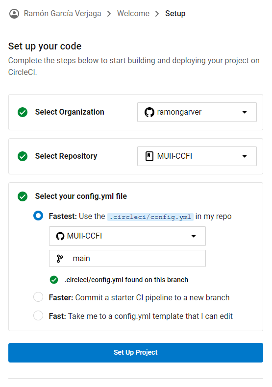
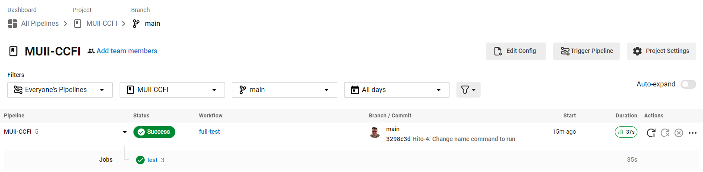
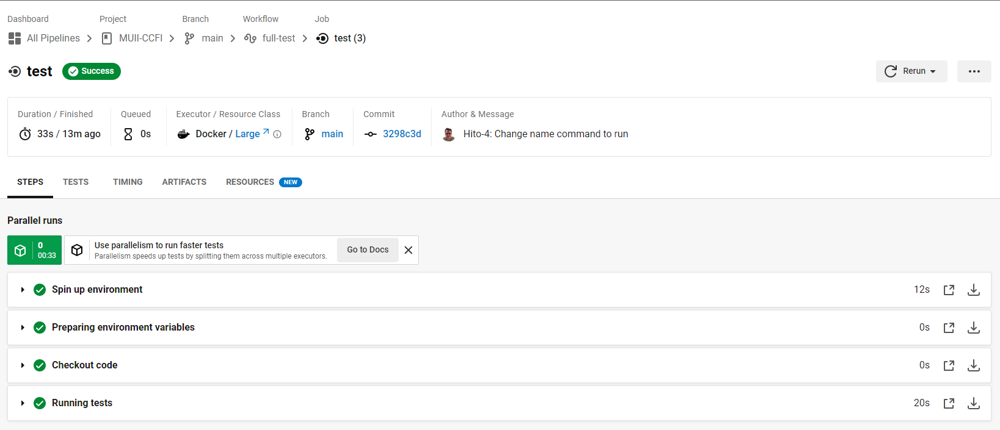
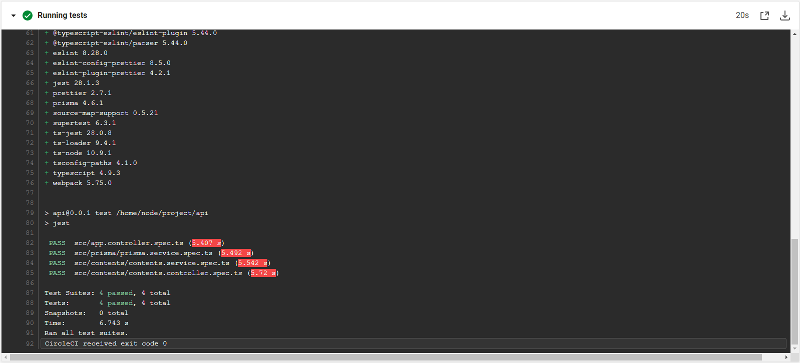
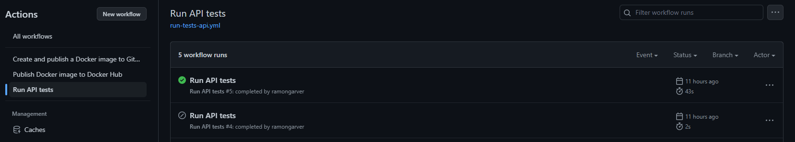
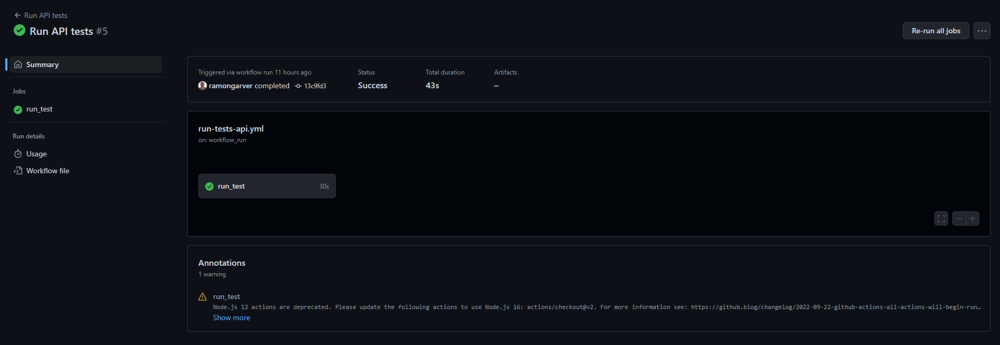
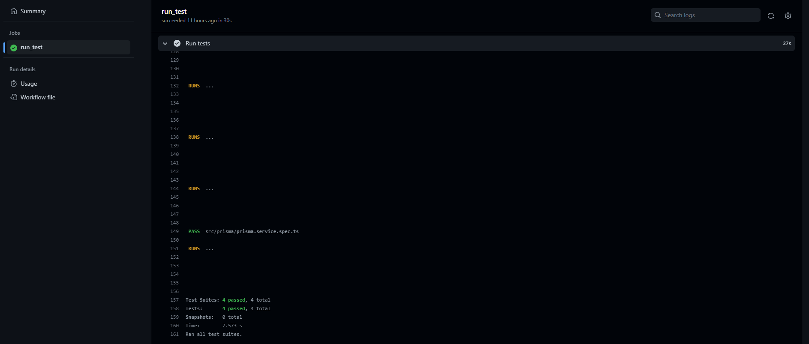

# [Hito 4](https://jj.github.io/CC/documentos/proyecto/4.CI): Integración continua

Este hito engloba todas las tareas necesarias para añadir integración continua al proyecto, a través del aprendizaje de cómo describir la versión del lenguaje de programación que se usa en el proyecto y la infraestructura que necesita para funcionar, así como de la elección de un sistema y sitio para integración continua y configuración del mismo.

## Comparativa de sistemas de integración continua

En la actualidad existen multitud de sistemas de integración continua. A continuación, vamos a exponer y elegir uno de ellos para nuestro proyecto.

[**Jenkins**](https://www.jenkins.io/): es una plataforma CI/CD de código abierto escrito en Java. Es altamente configurable y se puede utilizar para automatizar una amplia gama de tareas, incluida la construcción, prueba y despliegue de código. Jenkins es popular debido a su flexibilidad, escalabilidad y amplia gama de complementos que están disponibles para ampliar su funcionalidad.

- Ventajas:
  - Código abierto y altamente configurable.
  - Amplia gama de plugins disponibles para ampliar la funcionalidad.
  - Escalable y usable en una gran cantidad de proyectos.
- Desventajas:
  - Su instalación y mantenimiento pueden resultar complejos.
  - Requiere un servidor dedicado o un entorno en el que ser alojado.

[**Travis CI**](https://www.travis-ci.com/): es un servicio de CI basado en la nube que está diseñado para ser fácil de usar y configurar. Es popular entre los proyectos de código abierto, ya que es gratuito para los proyectos de código abierto y se integra con GitHub. Travis CI puede utilizarse para compilar, probar y desplegar código en una gran variedad de lenguajes y entornos.

- Ventajas:
  - Basado en la nube y fácil de configurar.
  - Gratis para proyectos de código abierto.
  - Integración con GitHub.
- Desventajas:
  - Puede no ser tan adecuado para proyectos más grandes y complejos.
  - Sus opciones de personalización están limitadas en comparación con otros sistemas de integración continua.

[**Azure DevOps**](https://azure.microsoft.com/es-es/products/devops/#overview): es una plataforma CI/CD basada en la nube desarrollada por Microsoft. Incluye una serie de herramientas para el control de versiones, el seguimiento del trabajo y la integración y el despliegue continuos. Azure DevOps es especialmente adecuada para los equipos que utilizan tecnologías y herramientas de Microsoft, ya que se integra perfectamente con otros productos de Microsoft.

- Ventajas:
  - Basado en la nube y altamente escalable.
  - Se integra perfectamente con otras herramientas y tecnologías de Microsoft.
  - Ofrece una serie de herramientas para el control de versiones, seguimiento del trabajo y CI/CD.
- Desventajas:
  - Puede no ser tan adecuado para equipos que no utilicen tecnologías Microsoft.
  - La tarifas pueden ser compleja y no resultar rentables para los equipos más pequeños.

[**CircleCI**](https://circleci.com/): es una plataforma CI/CD basada en la nube que está diseñada para ser rápida y escalable. Es compatible con una amplia gama de lenguajes y tecnologías e incluye funciones como compilación paralela y rollback automático. CircleCI es popular entre los desarrolladores por su facilidad de uso y su amplia documentación.

- Ventajas:
  - Basado en la nube y altamente escalable.
  - Fácil de usar y configurar.
  - Compatible con una amplia gama de lenguajes y tecnologías.
  - Incluye funciones como compilación paralela y rollback automático.
- Desventajas:
  - Puede no ser tan adecuado para equipos con necesidades de integración continua muy específicas o complejas.
  - Integración limitada con otras herramientas en comparación con otros sistemas de integración continua.

[**GitHub Actions**](https://github.com/features/actions): es una plataforma CI/CD desarrollada por GitHub que está integrada en el repositorio de GitHub. Permite a los desarrolladores automatizar sus workflows de desarrollo de software, incluida la creación, las pruebas y el despliegue de código.

- Ventajas:
  - Totalmente integrada con GitHub, por lo que es fácil de configurar y utilizar para los equipos que ya utilizan GitHub para el control de versiones.
  - Sintaxis sencilla basada en YAML para definir workflows personalizados.
  - Compatible con una amplia gama de lenguajes y tecnologías.
  - Altamente escalable y capaz de gestionar proyectos de distintos tamaños y necesidades.
- Desventajas:
  - Puede no ser tan adecuado para equipos con necesidades de CI/CD muy específicas o complejas.
  - Integración limitada con otras herramientas en comparación con otras plataformas CI/CD.
  - No es tan personalizable como otras opciones.

En conclusión, las plataformas de integración continua como CircleCI, Azure y GitHub Actions son opciones aceptables para proyectos de tamaño pequeño. CircleCI destaca por su facilidad de uso y amplia compatibilidad, mientras que Azure es más completa pero más difícil de configurar. GitHub Actions es una opción fácil de usar gracias a su estrecha integración con GitHub, pero tiene menos características que las otras dos plataformas. Al elegir una plataforma de integración continua, es importante considerar las necesidades del proyecto y el equipo, y elegir la opción que ofrezca las características adecuadas y sea fácil de usar. Por ello, y en base a lo explicado anteriormente, elegimos CircleCI y GitHub como las plataformas de integración continua para nuestro proyecto.

## Creación del sistema de integración continua en CircleCI

Para crear el sistema de integración continua en CircleCI, debemos seguir los siguientes pasos:

1. Crear un [archivo de configuración](https://github.com/ramongarver/MUII-CCFI/blob/main/.circleci/config.yml) de CircleCI en el repositorio de GitHub.

```yml
version: 2.1

jobs:
  test:
    docker:
      - image: ramongarver/muii-ccfi:latest
    steps:
      - checkout
      - run:
          name: Running tests
          command: |
            cd api
            pnpm install-test
workflows:
  full-test:
    jobs:
      - test
```

2. Crear un proyecto en CircleCI y configurarlo en relación al repositorio de GitHub.



Pipeline del proyecto



Job test



Ejecución de los tests



## Creación del sistema de integración continua en Github Actions

Para crear el sistema de integración continua en Github Actions, debemos seguir los siguientes pasos:

1. Crear un nuevo workflow que se ejecute cada vez que se construye una nueva imagen de Docker.

```yml
name: Run API tests

on:
  workflow_run:
    workflows: ["Create and publish a Docker image to GitHub Container Registry"]
    branches: [main]
    types: [completed]

jobs:
  run_test:
    runs-on: ubuntu-latest
    if: ${{ github.event.workflow_run.conclusion == 'success' }}
    steps:
      - uses: actions/checkout@v2
      - name: Run tests
        run:
          docker run -t -v `pwd`:/app/test ramongarver/muii-ccfi
```

Ejecuciones del workflow



Pipeline del proyecto



Ejecución de los tests



## Conclusión
